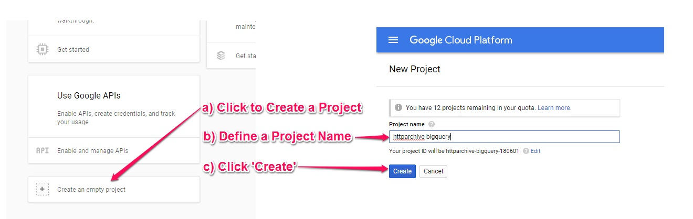
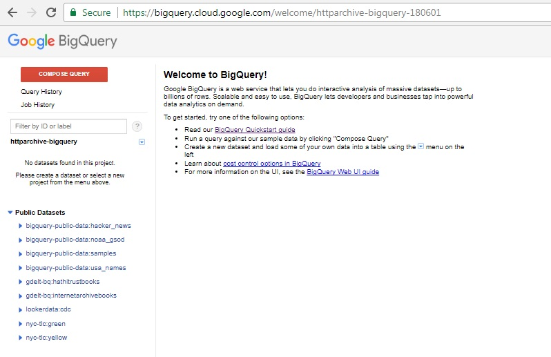
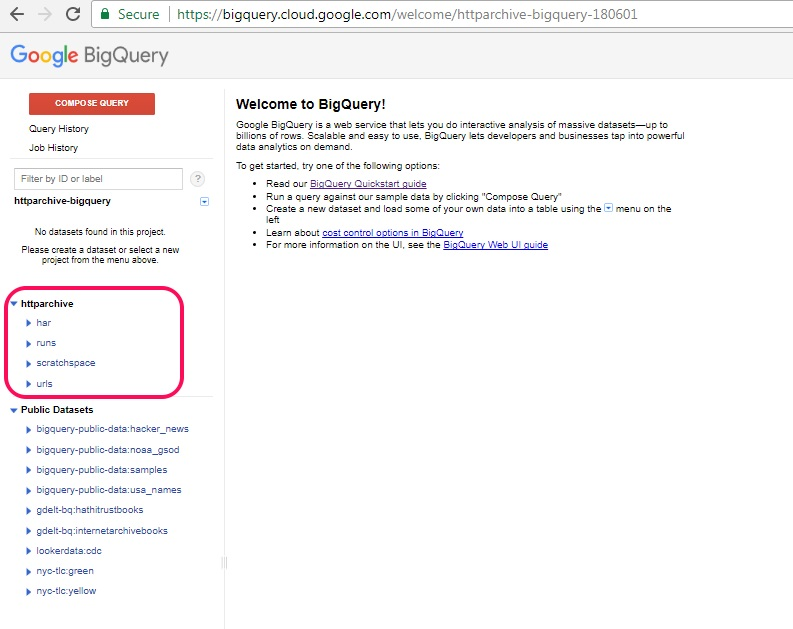
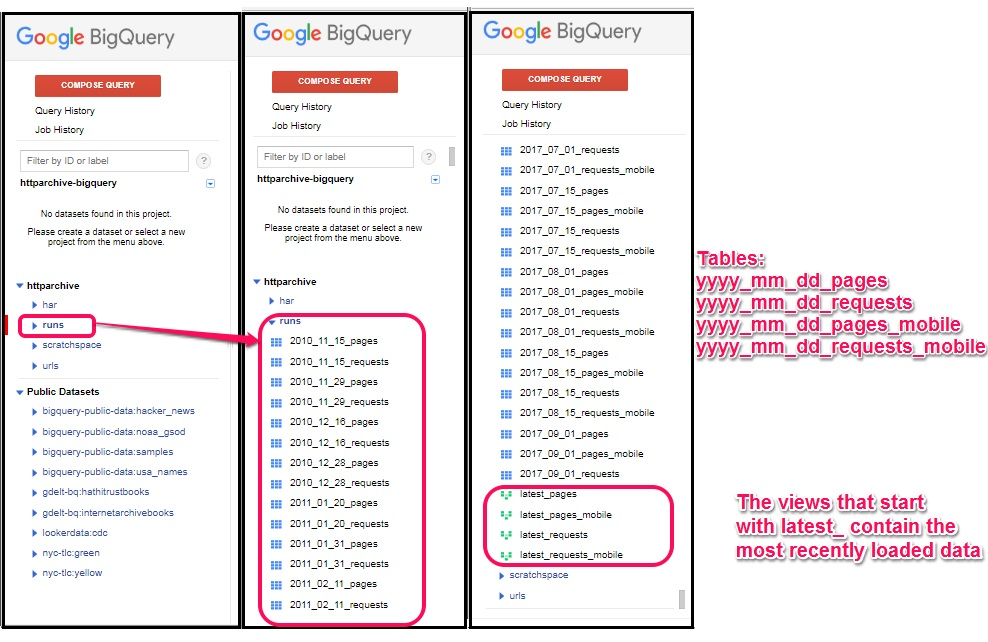
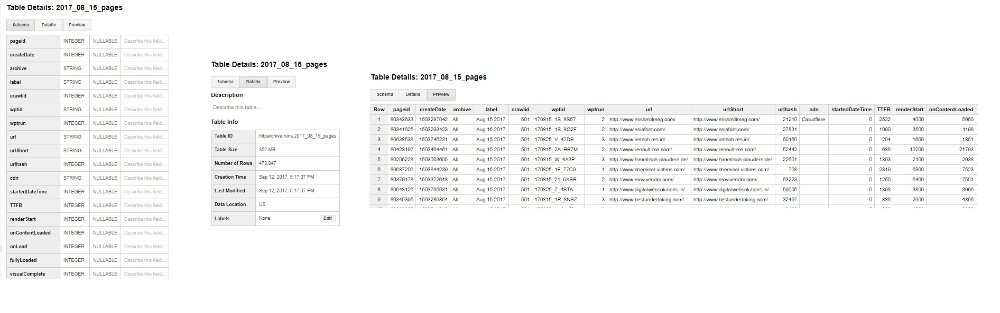
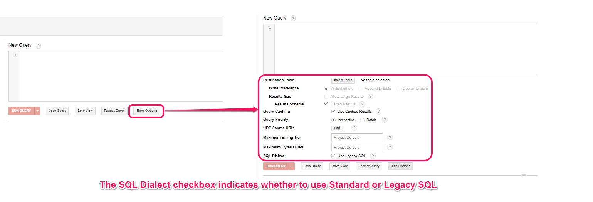
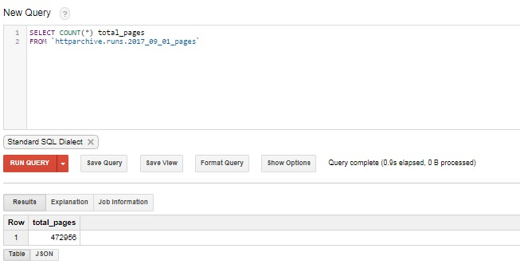
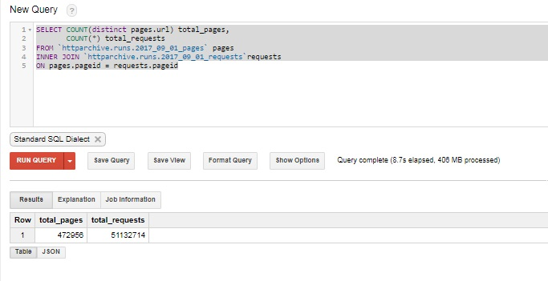
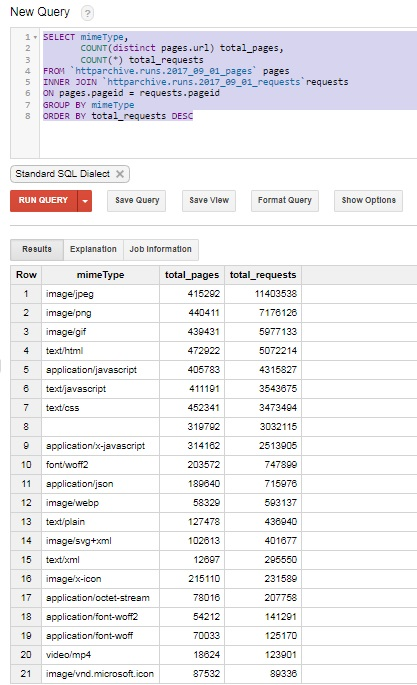
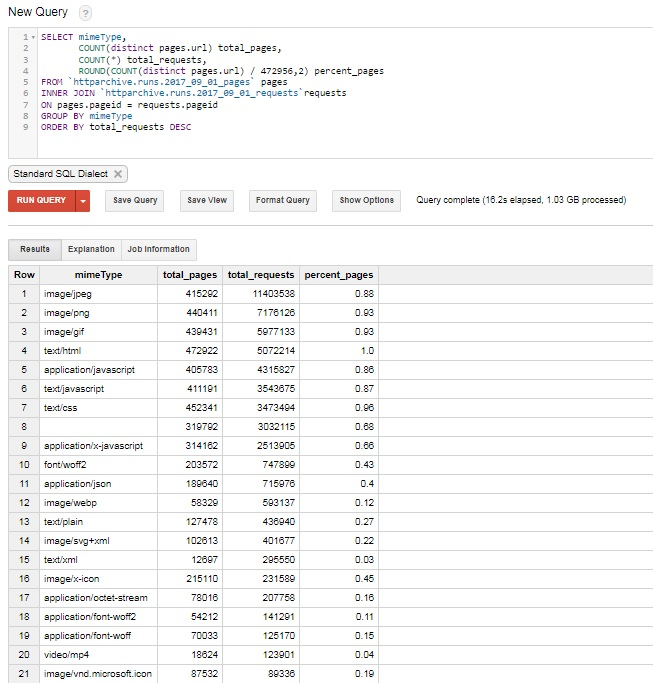

# Getting Started Accessing the HTTP Archive with BigQuery

The HTTP Archive is open source and the [raw data is available to download](http://httparchive.org/downloads.php).   If you want, you can download all of the data, process it locally and query it as much as you want.   However, that would require a lot of effort to set up.   Google BigQuery makes this much easier, since the data is already loaded and can be easily queried. And because of the processing power behind BigQuery, even some of the most complex queries you write will run extremely fast. 

This document is an update to [Ilya Grigorik's 2013 introduction](https://www.igvita.com/2013/06/20/http-archive-bigquery-web-performance-answers/), and will walk you through everything you need to get started accessing BigQuery and analyzing the data.

## Setting up BigQuery to Access the HTTP Archive

In order to access the HTTP Archive via BigQuery, you'll need a Google account.  To document this process for new visitors, this example uses a new Google account that has never logged into any Google Cloud services.

1. Navigate to the [Google Cloud Projects Page](https://console.cloud.google.com/start) and log in with your Google account if prompted.  If this is your first time accessing Google Cloud, you may be prompted to accept the ToS.
2. Click on the `Create an empty project` link.   This will take you to a New Project page.
3. Give your project a name and then click the `Create` button.

4. *Optional* Enable Billing by clicking on the Billing menu item and adding your billing information.   
    Note:  BigQuery has a [free tier](https://cloud.google.com/bigquery/pricing) that you can use to get started without enabling billing. At the time of this writing, the free tier allows 10GB of storage and 1TB of data processing per month. Google also provides a [$300 credit for new accounts](https://cloud.google.com/free/docs/frequently-asked-questions#free-trial).
5. Navigate to the [Big Query console](https://bigquery.cloud.google.com)

6. In order to add the HTTP Archive tables to your project, click on the dropdown menu next to your project name.   Then follow the example below to select "Display Project" and manually enter "httparchive"

7. At this point you should see the httparchive tables in your BigQuery dashboard.   If you expand the httparchive project, you'll see folders for har, runs, scratchspace and urls. In the next section, we'll explore the structure of these tables so you can start digging in!


## Understanding how the tables are structured
So, now you have access! But what do you have access to?

Most of the analysis we do is using tables in the httparchive.runs and httparchive.har datasets. If you expand httparchive.runs, you'll notice that there are tables for `pages`, `requests`, `pages_mobile` and `requests_mobile`. There are sets of these tables for each HTTP Archive run dating back since 2010. And scrolling to the bottom of the dataset, you'll notice that there are SQL views that start with `latest_`. The `latest_` views contain the most recent data, but can only be used with Legacy SQL (see below for difference between Legacy and Standard SQL)


In order to understand what each of these tables contain, you can click on the table name and view the details. For example, after clicking on the 2017_08_15_pages table you can see the schema. Clicking `Details` tells you some information about the table, such as it's size and the number of rows. Clicking `Preview` shows an example of some data from the table.



Some of the types of tables you'll find useful when getting started are:
### httparchive.runs Tables:
* yyyy_mm_dd_pages and yyyy_mm_dd_pages_mobile:
    * Each row contains details about a single page including timings, # of requests, types of requests and sizes.
    * Information about the page load such # of domains, redirects, errors, https requests, etc.
    * Summary of different caching parameters.
    * CDN indicator.
    * Each page URL is associated with a "pageid".
* yyyy_mm_dd_requests and yyyy_mm_dd_requests_mobile:
    * Every single object loaded by all of the pages.
    * Each object has a requestid and a pageid.  The pageid can be used to JOIN the _pages table.
    * Information about the object, and how it was loaded.
    * Contains some response headers for each object.
    * These tables are very large (yyyy_mm_dd_requests is 47GB as of Aug 2017).
    
### httparchive.har Tables:

The HTTP Archive stores detailed information about each page load in [HAR (HTTP Archive) files](https://en.wikipedia.org/wiki/.har). Each HAR file is JSON formatted and contains detailed performance data about a web page.  The [specification for this format](https://w3c.github.io/web-performance/specs/HAR/Overview.html) is produced by the Web Performance Working Group of the W3C. The HTTP Archive splits each HAR files into multiple BigQuery tables, which are described below.

* yyyy_mm_dd_chrome_pages and yyyy_mm_dd_android_pages:
    * HAR extract for each page url.
    * Table contains a url and a JSON-encoded HAR file for the document.
    * These tables are large (~3GB as of Aug 2017).
* yyyy_mm_dd_chrome_requests and yyyy_mm_dd_android_requests:
    * HAR extract for each resource.
    * Table contains a document url, resource url and a JSON-encoded HAR extract for each resource.
    * These tables are very large (yyyy_mm_dd_chrome_requests is 168GB as of Aug 2017).
* yyyy_mm_dd_chrome_requests_bodies and yyyy_mm_dd_android_requests_bodies:
    * HAR extract containing response bodies for each request.
    * Table contains a document url, resource url and a JSON-encoded HAR extract containing the first 2MB of each response body.   
    * Payloads are truncated at 2MB, and there is a column to indicate whether the payload was truncated.
    * These tables are very large (yyyy_mm_dd_chrome_requests_bodies is 760GB as of Aug 2017).
* yyyy_mm_dd_android_lighthouse and yyyy_mm_dd_chrome_lighthouse:
    * Results from a [Lighthouse](https://developers.google.com/web/tools/lighthouse/) audit of a page.
    * Table contains a url, and a JSON-encoded copy of the lighthouse report.
    * Lighthouse only runs on mobile pages. The chrome_lighthouse table contains null data and can be ignored. 
    

## Useful Links for BigQuery SQL Reference
BigQuery supports two SQL dialects: standard SQL and legacy SQL.  Legacy SQL is a non-standard SQL dialect that BigQuery started out using.   Standard SQL is a a SQL2011 compliant dialect that has many more features and functions.  Standard SQL is the preferred dialect for querying data via BigQuery, but both are supported.

[Documentation for Standard SQL](https://cloud.google.com/bigquery/docs/reference/standard-sql/)

[Documentation for Legacy SQL](https://cloud.google.com/bigquery/docs/reference/legacy-sql)

If you have existing Legacy SQL that you are trying to migrate to Standard SQL, then you may want to read the 

When you are ready to start writing queries, make sure that the SQL dialect option selected matches what you are writing your query in.   The current default is Legacy SQL, but de-selecting this will switch to Standard SQL


The [HTTP Archive Discuss section](https://discuss.httparchive.org/) has lots of useful examples and discussion on how to analyze this data.

## Some Example Queries to Get Started Exploring the Data
Now that you are all set up, let's run a query!  To start off, try running a simple aggregate query that tells you how many URLs are contained in the latest HTTP Archive data.

```
SELECT COUNT(*)
FROM `httparchive.runs.2017_09_01_pages`
```



Perhaps you want to JOIN the pages and requests tables together, and see how many page URLs and request URLs are in this data set.

```
SELECT COUNT(distinct pages.url) total_pages, 
       COUNT(*) total_requests
FROM `httparchive.runs.2017_09_01_pages` pages
INNER JOIN `httparchive.runs.2017_09_01_requests`requests
ON pages.pageid = requests.pageid
```

When we look at the results of this, you can see how much data was processed during this query.  Writing efficient queries limits the number of bytes processes - which is helpful since that's how BigQuery is billed.   *Note: There is 1TB free per month*



Let's extend this query to summarize  all of the HTTP requests by mime type.  In the example  below, you can see that I added `mimeType` to the SELECT clause, added a GROUP clause and sorted the results by mimeTypes that have the most requests.

```
SELECT mimeType,
       COUNT(distinct pages.url) total_pages, 
       COUNT(*) total_requests
FROM `httparchive.runs.2017_09_01_pages` pages
INNER JOIN `httparchive.runs.2017_09_01_requests`requests
ON pages.pageid = requests.pageid
GROUP BY mimeType
ORDER BY total_requests DESC
```

Now things are starting to get interesting.



So let's try to learn something from this basic example.   We know from the first example that there are 472,956 URLs in the latest HTTP Archive dataset.   Let's calculate the percent of pages that have each mimeType.  To do this, I simply added `ROUND(COUNT(distinct pages.url) / 472956,2) percent_pages` to the above query.

```
SELECT mimeType,
       COUNT(distinct pages.url) total_pages, 
       COUNT(*) total_requests,
       ROUND(COUNT(distinct pages.url) / 472956,2) percent_pages        
FROM `httparchive.runs.2017_09_01_pages` pages
INNER JOIN `httparchive.runs.2017_09_01_requests`requests
ON pages.pageid = requests.pageid
GROUP BY mimeType
ORDER BY total_requests DESC
```

When analyzing the results from this, you can see the % of websites that use different Content-Types for their JavaScript, you can see that 93% of sites have at least one PNG and GIF image, 40% of sites have application/json requests, 4% of sites have MP4 videos on their homepage, etc.  If you want to explore deeper you have everything you need - infrastructure, documentation, community.  



Enjoy exploring this data and feel free to share your results and ask questions on the [HTTP Archive Discuss section](https://discuss.httparchive.org/).


